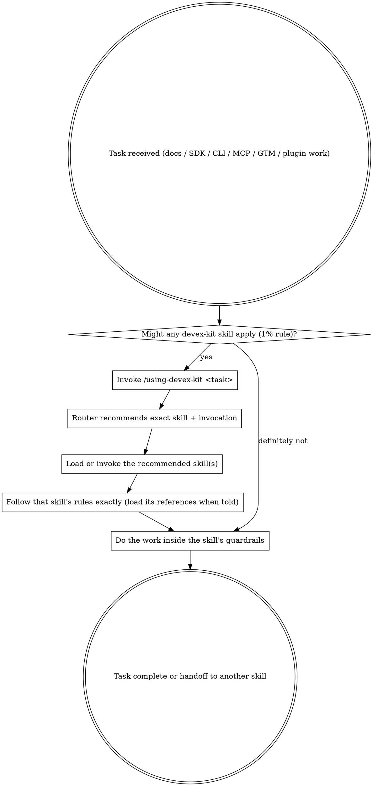

# Using DevEx Kit

**Invoke `/using-devex-kit` at the start of any devex or devrel task** (the same way you invoke using-superpowers for general agent skills). This skill analyzes the request and tells you exactly which devex-kit skill(s) to load or invoke next, with the precise slash command and arguments to use.

Claude Code (and compatible agents) will auto-route when the description matches, but explicitly starting with this skill ensures the right orchestration and catches combinations that a single skill would miss.

State your goal or paste the raw request. The router will classify, recommend, and give you the ready-to-paste invocation.

## The Rule

**Check for a devex-kit skill match BEFORE you start doing the work the skill covers.** 

If there is even a 1% chance a devex-kit skill applies to the current task, invoke the router (or the target skill directly if you are certain). The target skill's instructions then become mandatory.

Do not improvise patterns that a dedicated skill already encodes. The skills exist precisely to prevent common footguns in docs, SDKs, DX, GTM, and tooling.



## Red Flags — STOP and Route First

These thoughts mean you are about to skip the router (and the value of the kit):

| Thought | Reality |
|---------|---------|
| "I already know which skill to use" | The router catches cross-skill workflows, sequencing, and "use A then B" cases that a single skill never sees. |
| "This is just a quick docs question" | Quick questions are still contributions or style reviews. Router surfaces the right branch immediately. |
| "I'll just build the SDK the normal way" | sdk-craft encodes the exact design/build/document/ship sequence and phase gates that prevent bad SDKs. |
| "I can pick the content type myself" | docs-contribution-router + placement maps stop the most common "put it in the wrong place" errors. |
| "The task is too small for a formal skill" | Small tasks are where the biggest consistency wins (and losses) happen. |
| "I remember what the skill says" | Skills evolve. The current version (with its references) is the source of truth. Load it. |
| "I'll read the skill after I start" | The rule is: route first, then the skill's process becomes your process. Load it. |

All of the above mean: invoke `/using-devex-kit` (or the specific skill) before you write another sentence or line.

## Quick Routing Table

| Stated intent or keywords you hear | Recommended skill(s) | Example invocation (copy/paste ready) |
|------------------------------------|----------------------|---------------------------------------|
| "Document a customer issue", "where does this new concept go?", "add to the docs site", "API spec regenerated", "agent connector page", "integration guide", "sidebar change" | docs-contribution-router | `/docs-contribution-router I have a customer issue to document — users are confused about how session tokens are revoked when an org is disabled. Where does this go?` |
| "Review my draft for style/voice", "handoff mode for my agent", "does this match the house style", "writing style check" | docs-writing-style | `/docs-writing-style review mode. [paste draft or file path]`<br>`/docs-writing-style handoff mode. I'm writing a how-to for agent auth in Node.js.` |
| "My cookbook is hard to follow", "audit these recipes for quality", "starting a new cookbook", "skimmability / clarity issues in docs" | authoring-cookbooks | `/authoring-cookbooks My cookbook has plenty of content but readers say it's hard to follow. What's wrong?` |
| "Reorder sidebar as journey", "review these nav labels for sentence case", "sidebar is alphabetical", "journey order in navigation" | journey-sidebar-labels | `/journey-sidebar-labels Review these sidebar group labels for sentence case and journey order: [paste]` |
| "Building / designing an SDK", "client library", "API surface design", "error messages for SDK", "TypeScript SDK", "publish to npm", "breaking change migration" | sdk-craft | `/sdk-craft I'm building a TypeScript SDK for our REST API. Start with design phase — help me define the public API surface.` |
| "Build a CLI tool", "add shell completions", "generate Postman collection from routes", "developer-facing CLI", "commander / click / typer / cobra" | devrel-tooling | `/devrel-tooling Build a CLI tool for our SDK that scaffolds new projects. Node.js, commander.` |
| "Building an MCP server", "design MCP tools", "MCP security / auth", "test MCP with agents", "stdio vs Streamable HTTP" | mcp-server-craft | `/mcp-server-craft I'm building an MCP server to expose our search API to AI agents. Help me design the tool schemas.` |
| "Creating a new skill", "writing SKILL.md", "restructure a plugin", "agent-plugin-development", "build spawnable agents", "externalize references", "devex-kit skill" | agent-plugin-development | `/agent-plugin-development I'm creating a new skill for docs engineering. Start with the model phase.` |
| "Launch story", "TAB playbook", "dev influencer presence", "packaging and pricing for devs", "authentic dev story", "12 story mistakes" | devrel-story-craft | `/devrel-story-craft plan TAB for connectors. Help me recruit and draft the first call questions.`<br>`/devrel-story-craft review mode. Here's my draft launch story...` |
| "First success", "sample app vs recipe vs pattern", "DX journey", "content jobs", "onboarding for devs", "technical engagement system", "translator" | devrel-dx-craft | `/devrel-dx-craft plan first-success. For the connectors feature, choose Sample Application vs Recipe vs Pattern and outline the DX path.` |

When the task legitimately spans two skills (very common), the router will tell you the sequence and what to hand off.

## How to Invoke (by environment)

**Claude Code (installed via skills.sh or tessl):**
```
/using-devex-kit <your task description>
```
Then immediately follow the returned recommendation, e.g. paste the suggested `/sdk-craft ...` line.

**Local development (no install):**
```
/skills load ./skills/tooling/using-devex-kit/SKILL.md
/using-devex-kit I need to design a new SDK...
```
(The load only needs to happen once per session or after edits.)

**After the router responds, load the target the same way:**
```
/skills load ./skills/tooling/sdk-craft/SKILL.md
/sdk-craft ...
```

See the root README for the full list of load paths for every skill.

**Grok / other environments that surface .agents/skills:**
Skills under `.agents/skills/` are auto-discovered. The `/using-devex-kit` and `/<skill-name>` shorthands work directly when the user message starts with the slash (per your system rules). The router still provides the same value: it forces explicit choice and sequencing before you begin.

## Multi-skill Workflows (common patterns)

Many real tasks are pipelines:

- Story validation (devrel-story-craft) → first-success DX design (devrel-dx-craft) → actual sample / recipe authoring (authoring-cookbooks + docs-writing-style)
- DX audit (devrel-dx-craft) → SDK work (sdk-craft) or CLI work (devrel-tooling)
- New integration info (docs-contribution-router) → style handoff (docs-writing-style)
- New skill you are writing (agent-plugin-development) → may also touch devrel-tooling or mcp-server-craft if the skill is about those domains

The router will surface the order and any "use X for phase 1, then hand off to Y" instructions. Each target skill contains its own "When to switch skills" and "Integration Graph" sections that reinforce the handoff contract.

## When to switch skills

- You are already inside a target skill and the task clearly moved to a different domain → stop and let the user invoke the next skill (or re-invoke this router with the new state).
- The current skill's "When to switch skills" section explicitly names another devex-kit skill → follow it.
- The work is purely about the mechanics of writing/shipping skills themselves (not the content of the skill) → agent-plugin-development.
- You need general agent process discipline (TDD, brainstorming, verification-before-completion, etc.) → those live in the superpowers set; devex-kit skills complement them but do not replace them.

## Quality Checklist (for this router)

Before ending the routing session:

- [ ] Intent was mapped to one or more concrete skills with exact names.
- [ ] User received at least one ready-to-use slash invocation (with example arguments).
- [ ] Sequencing / multi-skill cases were called out when present.
- [ ] Platform-specific load instructions were given if the user is working locally.
- [ ] Red-flag rationalizations were countered if they appeared.
- [ ] "Did this help?" question was asked at the end.

## Did this help?

At the end of every routing session, ask: **"Did this solve what you were trying to do?"**

- If yes: done. The user now knows the exact next skill(s) to invoke.
- If the routing was wrong, a skill was missing from the table, a common scenario was not covered, or the handoff was unclear: encourage the user to file an issue at **https://github.com/saif-shines/devex-kit/issues**. Offer to help draft the issue using their agent — include: what they were trying to do, what this router produced, and what was missing or incorrect.

This meta-skill exists so every other skill in the kit gets used correctly and completely.
